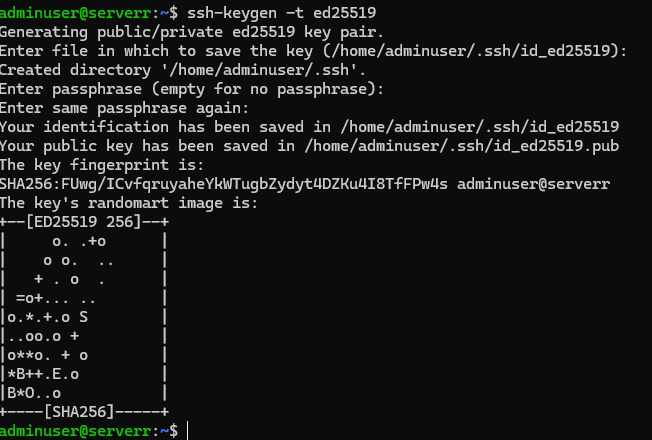
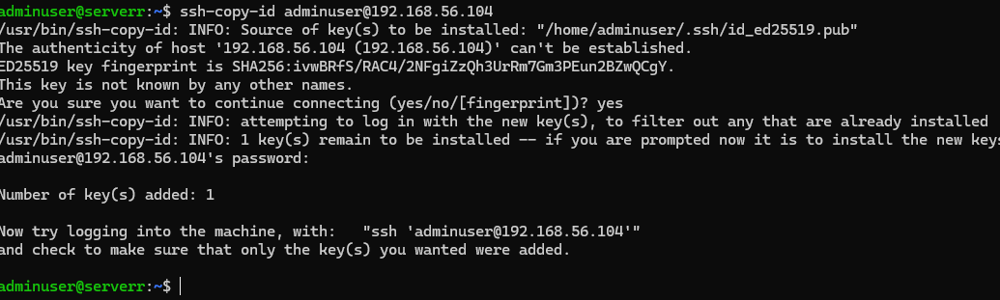
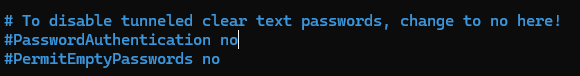
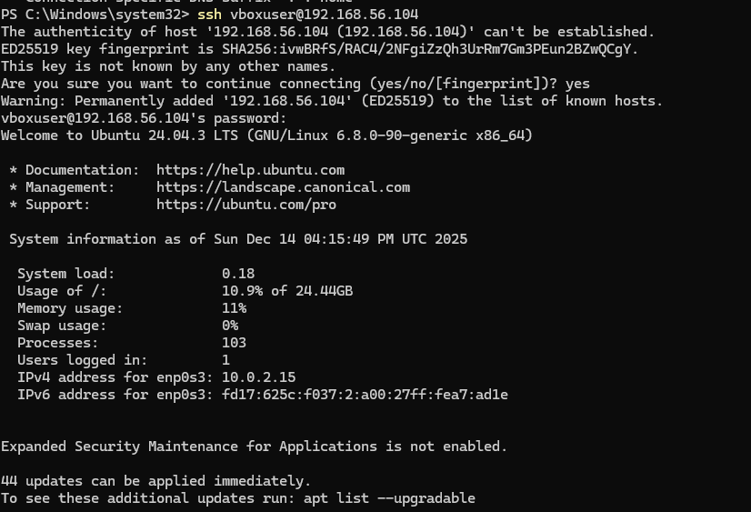
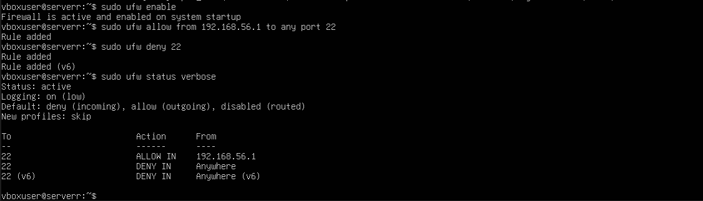

### Week 4 – Initial System Configuration and Security Implementation

## Overview

In Week 4 I focused on configuring the server for secure remote access and improving the overall security of the system. All work in this week was completed remotely through SSH, continuing the headless server setup from the previous weeks.

The main goals were to enable key-based SSH authentication, restrict who can access the server, configure firewall rules, and introduce a safer user management approach.

# SSH Key-Based Authentication

SSH keys were generated on the workstation and copied to the server so that logging in could be done using key-based authentication instead of passwords.

After confirming that key authentication worked correctly, password authentication and root login were disabled in the SSH configuration file. This helps reduce the risk of brute-force attacks and prevents direct root access over SSH.

The purpose of this step was to make remote access more secure while still allowing full management of the server through SSH.

# Firewall Configuration

The firewall was configured using UFW to control which devices are allowed to connect to the server.

UFW was enabled and a rule was added to allow SSH traffic only from the workstation IP address. All other inbound connections were blocked by default. This reduces unnecessary exposure and limits access to trusted systems only.

# User Management

A new non root administrative user was created so that system administration does not have to be carried out using the root account.

The new user was added to the sudo group so that administrative commands can still be executed when needed, but in a safer and more controlled way that follows the principle of least privilege.

# Remote Administration

All configuration tasks in this week were completed remotely through SSH. No graphical interface or local console access was used.

This keeps the environment realistic to real-world server administration, where servers are normally managed remotely and through the command line.

### SSH Key-Based Authentication

### SSH Access Verification

### User and Privilege Management

### Firewall Configuration

