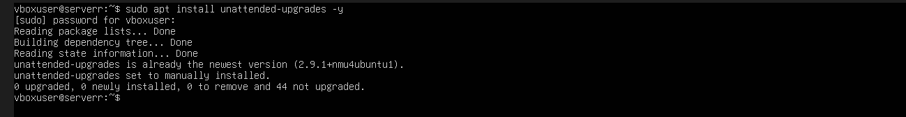
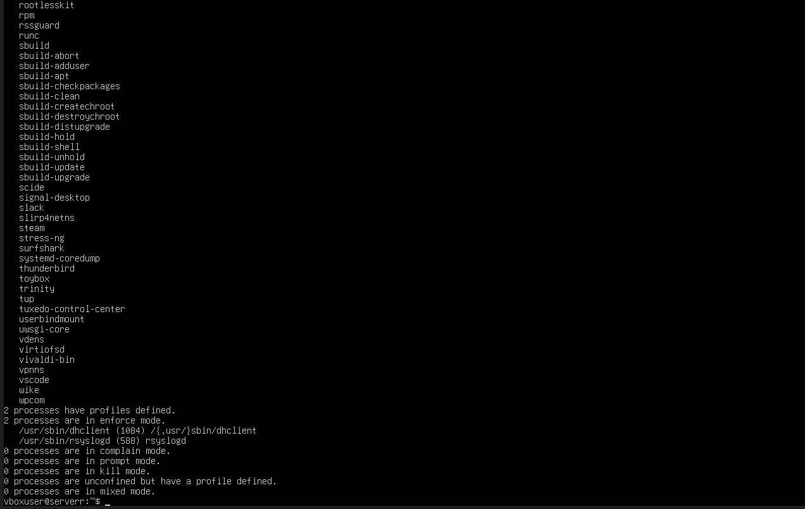
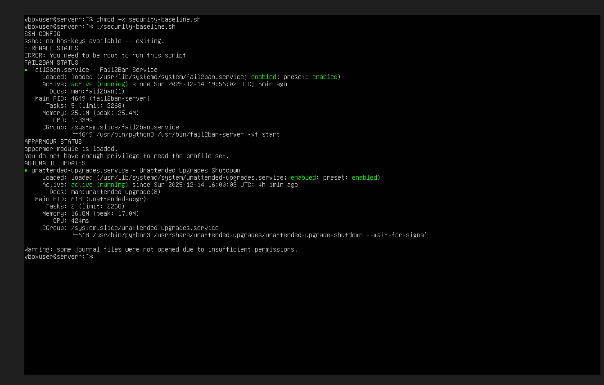
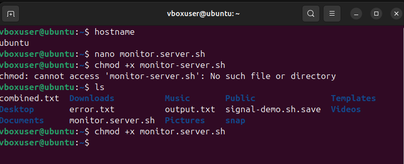

# Week 5 – Advanced Security and Monitoring Infrastructure

## Overview
This week focused on strengthening the system’s security posture and introducing monitoring mechanisms to support ongoing administration. The aim was to detect unauthorised activity, enforce security policies, and improve visibility of system status while maintaining SSH-only administration.

---

## Mandatory Access Control

AppArmor was enabled to provide mandatory access control at the operating system level. This restricts what applications are allowed to do, even if they are compromised.

Enforcement status and loaded profiles were verified to ensure AppArmor was active and protecting system processes.

---

## Intrusion Detection – fail2ban

fail2ban was installed and configured to protect the SSH service from brute-force login attempts. The service monitors authentication logs and automatically blocks IP addresses that exhibit repeated failed login attempts.

This significantly reduces the risk of automated SSH attacks while requiring minimal system overhead.

---

## Security Baseline Verification

Security configuration was verified by checking:
- SSH service status
- Firewall configuration
- fail2ban service state
- Overall server status

This ensures that previously implemented security controls remain active and correctly configured.

---

## Monitoring Script

A monitoring script (`monitor-server.sh`) was created and made executable. The script connects to the server via SSH and collects key system metrics including:
- Hostname and uptime
- CPU load
- Memory usage
- Disk usage
- Active users

This provides a quick overview of system health and supports proactive administration.

The script was tested and permissions were set using `chmod`.

---

## Evidence

### System & Security Setup

### fail2ban Configuration

### Monitoring Script

