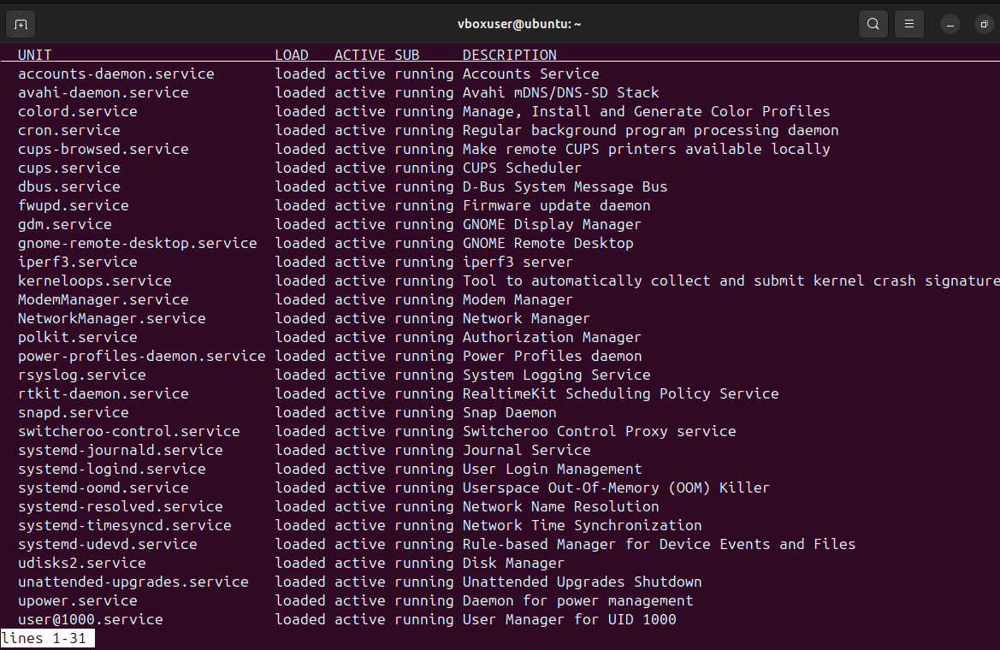
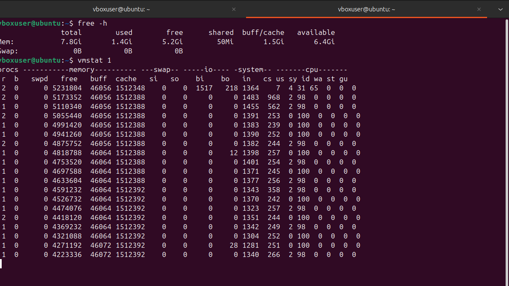
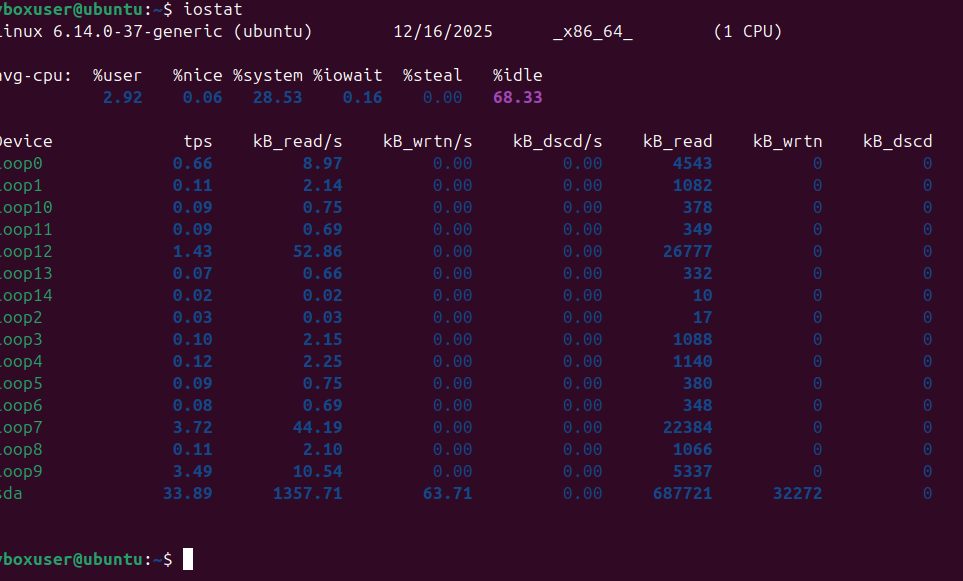
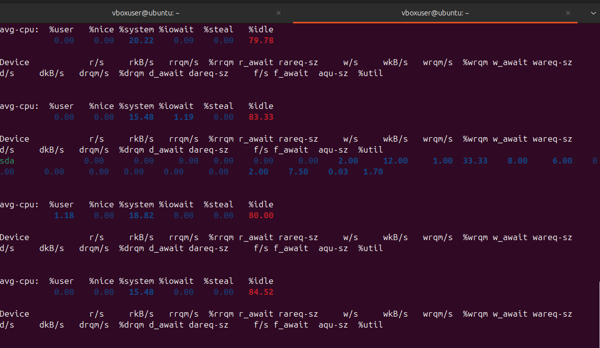
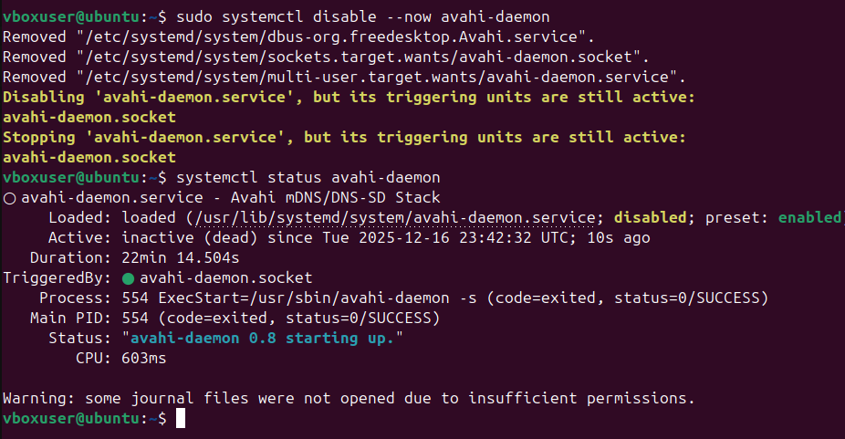
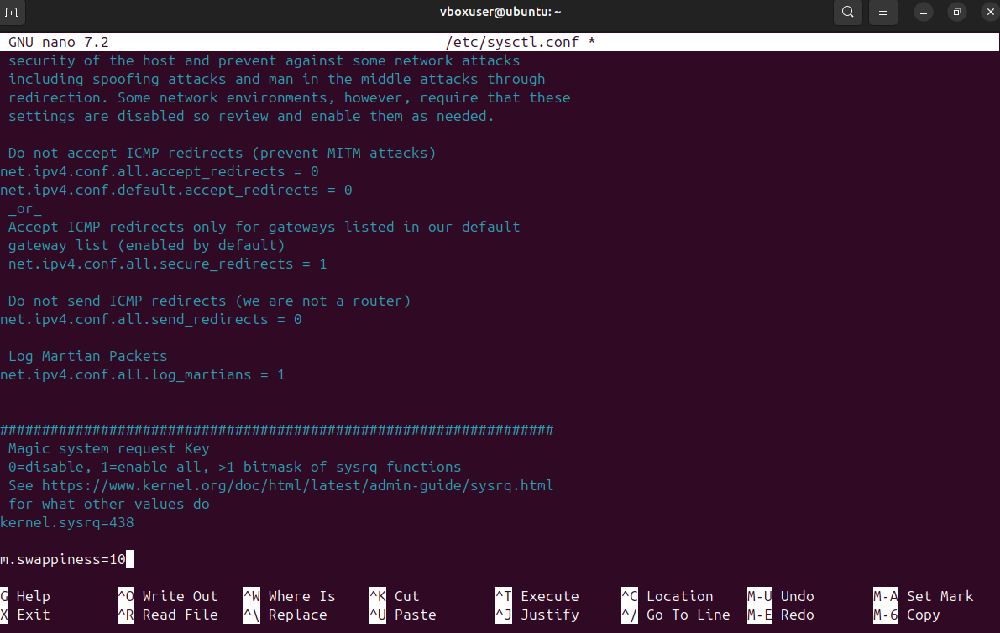

### Week 6 – Performance Evaluation and Analysis

## Overview

In Week 6 the focus was on evaluating how the Ubuntu Server performs under different types of workload and system stress. The aim was to observe how the operating system behaves, identify any performance bottlenecks, and then apply small optimisations to improve stability and responsiveness.

All performance testing was carried out remotely through SSH, with system activity and metrics monitored in real time while the workloads were running.

# Methodology

To keep the testing structured, a step-by-step approach was followed:

A baseline was recorded while the server was idle, so normal behaviour could be used as a comparison point.

Different workloads were applied to individual system resources such as CPU, memory, disk and network. This helped to isolate how each resource behaved under load.

The results and monitoring output were reviewed to identify bottlenecks and resource constraints.

System configuration changes were applied and the tests were repeated to see whether performance and recovery improved.

This approach makes it easier to compare behaviour before and after optimisation.

# CPU and Scheduling

CPU activity and scheduling behaviour were monitored while workloads were running. Tools such as mpstat and vmstat were used to observe how CPU usage changed over time and how the system handled periods of higher activity.

# Memory Usage

Memory behaviour was analysed under load using vmstat, with a focus on memory pressure and swap usage. This helped to show how the system reacted when available RAM was reduced.

# Disk I/O

Disk performance was monitored using iostat while sustained disk operations were running. This made it possible to see how read and write activity affected I/O wait times and responsiveness.

# Network Throughput

Network performance was tested using iperf3 between the workstation and the server. Connectivity and latency were also checked using ping to confirm network stability during testing.

# Bottleneck Analysis

From the monitoring results, the main bottlenecks identified were:

Memory pressure leading to increased swap usage during heavier workloads

Disk I/O latency during sustained write operations

These issues caused slower responsiveness and higher I/O wait times when the system was under load.

Optimisations

To address the identified bottlenecks, the following optimisation steps were applied:

The virtual memory swappiness value was reduced so that the system would prioritise physical RAM instead of swapping too early.

Unnecessary background services were disabled to reduce system overhead and free up resources.

These changes were chosen because they are lightweight but can have a noticeable impact on performance in a small virtualised server environment.

# Results

After applying the optimisations and rerunning the tests:

- Swap usage was reduced
- System responsiveness improved under load
- CPU and memory activity stabilised more quickly after workloads stopped
- Disk I/O wait times showed improvement during sustained operations

Overall, the server handled load more smoothly and recovered faster once the workload was removed.

## Evidence

### Baseline System State

### CPU and Memory Monitoring

### Disk I/O Testing

### Network Testing

### System Configuration and Services

